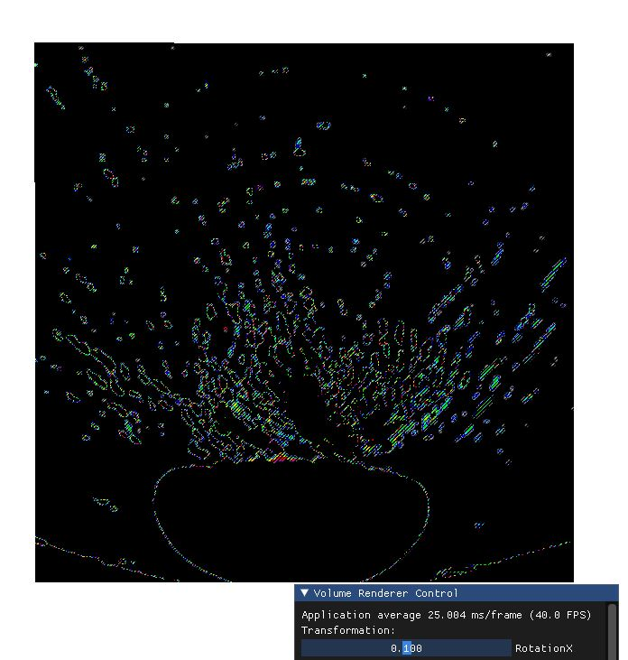

## A Direct Volume Renderer implementation using Raycasting

### Dependencies
<ul>
  <li>GLFW</li>
  <li>GLEW</li>
  <li>DearImGUI</li>
  <li>GLM</li>
</ul>
All these dependencies are already there in the project.

### Build
The project was developed on Windows, Visual Studio (2019). The project is self contained. Run the solution (VolumetricRendering.sln file) in Debug mode on Visual Studio.
The paths should not be a problem but in the offset chance that there are, please set the paths accordingly.

#### Some References:

1. [Chapter 39. Volume Rendering Techniques](https://developer.nvidia.com/gpugems/gpugems/part-vi-beyond-triangles/chapter-39-volume-rendering-techniques)

2. [N. Morrical, W. Usher, I. Wald and V. Pascucci, "Efficient Space Skipping and Adaptive Sampling of Unstructured Volumes Using Hardware Accelerated Ray Tracing," 2019 IEEE Visualization Conference (VIS), Vancouver, BC, Canada, 2019, pp. 256-260, doi: 10.1109/VISUAL.2019.8933539.](https://ieeexplore.ieee.org/document/8933539)

  
TODO: 

  <ul>
    <li>TransferFunction Graph Manipulation</li>
    <li>Isosurfaces</li>
    <li>CMake Solution</li>
  </ul>

